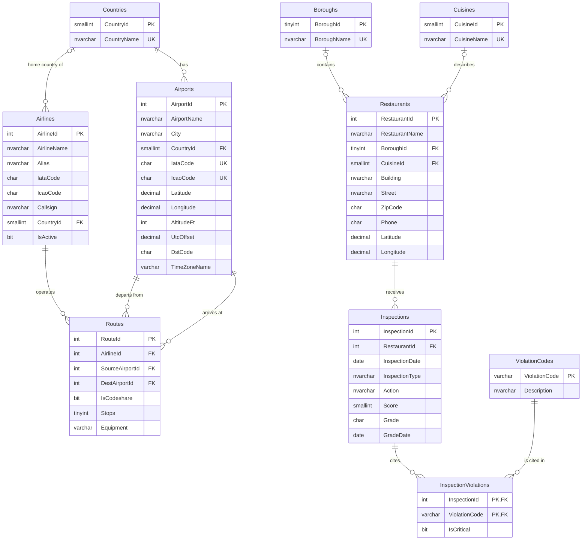

# Flights & Restaurants - a T-SQL portfolio project

A complete, reproducible SQL Server project built on two real public datasets:

- **OpenFlights** - airports, airlines and routes of the world
- **NYC DOHMH Restaurant Inspection Results** - every violation cited in a New York City restaurant inspection during 2025

One command downloads the raw files, builds a normalized database with primary keys, foreign
keys and constraints, cleans and loads about 168,000 raw rows into 10 tables (about 212,000 rows
after normalization), and creates the views. Ten documented queries then answer concrete business
questions, and a verification script checks that every query and view runs and returns data.

| | |
|---|---|
| **Database** | Microsoft SQL Server (built and tested on SQL Server 2025 Express; needs 2017 or later) |
| **Language** | T-SQL, plus PowerShell for automation |
| **Authentication** | Windows authentication only - there is no password in any file |
| **Size** | 10 tables, 2 views, 10 query files, 4 staging tables |

## What it demonstrates

| Topic | Where |
|---|---|
| Schema design: normalization, PK / FK, unique, check, filtered unique indexes | [sql/02_create_tables.sql](sql/02_create_tables.sql) |
| ELT load: `BULK INSERT` into staging, then clean with `INSERT ... SELECT` | [sql/04_load_staging.sql](sql/04_load_staging.sql), [sql/05_load_openflights.sql](sql/05_load_openflights.sql), [sql/06_load_restaurants.sql](sql/06_load_restaurants.sql) |
| Data cleaning: `\N` nulls, `TRY_CONVERT`, pattern checks, de-duplication, transactions | same files |
| Anti-join (`NOT EXISTS` vs `LEFT JOIN ... IS NULL`) | [queries/01](queries/01_airports_without_departures.sql) |
| Multi-table joins, same table joined twice | [queries/02](queries/02_routes_arriving_at_jfk.sql) |
| `GROUP BY`, `HAVING`, `ORDER BY`, `TOP` | [queries/03](queries/03_airports_per_country.sql) |
| Views, haversine distance, `CROSS APPLY`, `STRING_AGG` | [views/vw_RouteDistances.sql](views/vw_RouteDistances.sql), [queries/04](queries/04_longest_routes.sql) |
| CTEs | [queries/05](queries/05_busiest_airports.sql) |
| Window functions (`RANK() OVER (PARTITION BY ...)`, running totals) | [queries/06](queries/06_top_airlines_per_country.sql), [queries/10](queries/10_restaurants_by_critical_violation_band.sql) |
| Correlated subquery | [queries/07](queries/07_airports_above_country_average.sql) |
| Conditional aggregation | [views/vw_RestaurantViolationCounts.sql](views/vw_RestaurantViolationCounts.sql) |
| Automated verification | [scripts/verify.ps1](scripts/verify.ps1) |

## Data sources

| Dataset | Source | Files used |
|---|---|---|
| OpenFlights | <https://openflights.org/data> - files from the official GitHub repo <https://github.com/jpatokal/openflights> (`data/` folder) | `airports.dat`, `airlines.dat`, `routes.dat` |
| DOHMH New York City Restaurant Inspection Results | NYC Open Data, dataset `43nn-pn8j`: <https://data.cityofnewyork.us/Health/DOHMH-New-York-City-Restaurant-Inspection-Results/43nn-pn8j> | a subset through the SODA API (below) |

**The exact NYC subset.** The full dataset has about 300,000 rows. The download script requests
only inspections dated in **calendar year 2025**, and only the 19 columns the schema uses:

```text
https://data.cityofnewyork.us/resource/43nn-pn8j.csv
  $select = camis, dba, boro, building, street, zipcode, phone, cuisine_description,
            inspection_date, inspection_type, action, score, grade, grade_date,
            violation_code, violation_description, critical_flag, latitude, longitude
  $where  = inspection_date between '2025-01-01T00:00:00' and '2025-12-31T23:59:59'
  $order  = camis, inspection_date, inspection_type, violation_code
  $limit  = 200000      (a safety cap; the script fails if it is ever reached)
```

This returned **86,897 rows** for 17,917 restaurants on 2026-10-08. A closed date range was chosen
so the subset does not grow every day, and it also leaves out the `1900-01-01` placeholder rows of
restaurants that have not been inspected yet. The city still edits the dataset daily (for example,
restaurants that close are removed), so a later download can differ by a few rows.

**OpenFlights is a historical snapshot.** According to OpenFlights, its route data is no longer
updated (last update: June 2014), so the results describe the airline world of that time - US
Airways still exists in it.

### Attribution and license

- Airport, airline and route data from [OpenFlights](https://openflights.org/data). The OpenFlights
  Airport, Airline and Route Databases are made available under the
  [Open Database License (ODbL) v1.0](https://opendatacommons.org/licenses/odbl/1-0/). Any rights
  in individual contents of the database are licensed under the
  [Database Contents License (DbCL) v1.0](https://opendatacommons.org/licenses/dbcl/1-0/).
- Restaurant inspection data is published by the New York City Department of Health and Mental
  Hygiene (DOHMH) through [NYC Open Data](https://opendata.cityofnewyork.us/).

No raw data is stored in this repository: `data/raw/` is git-ignored and re-created by
`scripts/download_data.ps1`.

## Schema

### Tables

| Table | Rows | Primary key | Foreign keys | Other constraints |
|---|---:|---|---|---|
| `Countries` | 237 | `CountryId` (identity) | - | unique `CountryName` |
| `Airports` | 7,698 | `AirportId` (OpenFlights id) | `CountryId` -> `Countries` | unique `IataCode` and `IcaoCode` when not null (filtered indexes); latitude / longitude range checks |
| `Airlines` | 6,161 | `AirlineId` (OpenFlights id) | `CountryId` -> `Countries` (nullable) | - |
| `Routes` | 66,315 | `RouteId` (identity) | `AirlineId` -> `Airlines`; `SourceAirportId`, `DestAirportId` -> `Airports` | unique (`AirlineId`, `SourceAirportId`, `DestAirportId`); check source <> destination |
| `Boroughs` | 5 | `BoroughId` (identity) | - | unique `BoroughName` |
| `Cuisines` | 88 | `CuisineId` (identity) | - | unique `CuisineName` |
| `Restaurants` | 17,917 | `RestaurantId` (the city's CAMIS id) | `BoroughId` -> `Boroughs`; `CuisineId` -> `Cuisines` | - |
| `Inspections` | 27,463 | `InspectionId` (identity) | `RestaurantId` -> `Restaurants` | unique (`RestaurantId`, `InspectionDate`, `InspectionType`); check `Score >= 0` |
| `ViolationCodes` | 103 | `ViolationCode` | - | - |
| `InspectionViolations` | 85,949 | (`InspectionId`, `ViolationCode`) | `InspectionId` -> `Inspections`; `ViolationCode` -> `ViolationCodes` | - |

All tables are in the `dbo` schema. The raw files are first loaded into four all-text tables in a
separate `stg` schema (`stg.Airports`, `stg.Airlines`, `stg.Routes`, `stg.RestaurantInspections`).

### ER diagram



### How the data is loaded

Loading is **ELT** in two steps, so that one bad value can never abort a file load:

1. `BULK INSERT` copies each raw file as-is into a staging table whose columns are all text.
2. Plain `INSERT ... SELECT` statements clean, convert and normalize staging into the real
   tables, in foreign-key order, inside one transaction per dataset.

| Problem in the raw data | How it is handled |
|---|---|
| OpenFlights writes NULL as the two characters `\N` | `NULLIF(col, '\N')`; empty strings become NULL too |
| Apostrophes escaped as `\'` or `\\'` (`Port O\'Connor`) | `REPLACE` |
| Numbers and dates arrive as text | `TRY_CONVERT` (returns NULL instead of failing) |
| Junk airline codes (`-`, `N/A`, `??`, `+-`) | a code is kept only if it has the right length and only letters / digits |
| Airline countries spelled differently from airport countries | a 13-row alias list (`Republic of Korea` -> `South Korea`, ...); values that are not a country stay NULL (85 airlines) |
| Routes that reference a missing airline / airport | rejected by the inner joins: 1,348 of 67,663 rows (898 with a `\N` id, 449 with an airport id that is not in `airports.dat`, 1 from an airport to itself) |
| Airline id `-1` ("Unknown") | not an airline - skipped |
| NYC file is one wide row per violation, repeating restaurant and inspection columns | split into `Restaurants` -> `Inspections` -> `InspectionViolations` |
| Borough `0`, latitude / longitude `0` | placeholders for "unknown" -> NULL |
| Same violation code with several wordings of its description | the most used wording per code is kept (`ROW_NUMBER`) |
| 7 exact duplicate violation rows | collapsed by `GROUP BY` |

Every row is accounted for: 86,897 NYC rows = 85,956 rows with a violation (85,949 after removing
the 7 duplicates) + 941 rows for inspections with no violation.

## Setup from zero

Requirements: Windows, Git, Windows PowerShell 5.1 (included in Windows), SQL Server 2017 or later,
and `sqlcmd`.

**1. Install SQL Server Express and sqlcmd** (skip what you already have). In PowerShell:

```powershell
winget install -e --id Microsoft.SQLServer.2022.Express
winget install -e --id Microsoft.Sqlcmd
```

Any newer edition works as well (this project was built on SQL Server 2025 Express); installers
are at <https://www.microsoft.com/sql-server/sql-server-downloads>. Open a **new** PowerShell
window afterwards so `sqlcmd` is on the PATH.

**2. Get the project**

```powershell
git clone <repository-url>
cd nyc-flights-restaurants-sql
```

**3. Check the connection**

```powershell
.\scripts\test_connection.ps1
```

**4. Build everything with one command**

```powershell
.\scripts\reset.ps1
```

This drops `FlightsRestaurantsDB` if it exists, downloads the raw files into `data/raw/` if they
are missing (about 42 MB), creates the database and tables, loads the data and creates the views.
It takes about 10 to 15 seconds once the files are downloaded. Use `.\scripts\reset.ps1 -Download` to force a fresh
download.

**5. Verify**

```powershell
.\scripts\verify.ps1
```

**Other instances.** Every script takes `-ServerInstance`. The default is
`lpc:localhost\SQLEXPRESS`; for a default (unnamed) instance use for example
`.\scripts\reset.ps1 -ServerInstance localhost`.

**If PowerShell refuses to run scripts**, start them like this instead:
`powershell -ExecutionPolicy Bypass -File .\scripts\reset.ps1`

### Scripts

| Script | What it does |
|---|---|
| `scripts/test_connection.ps1` | Checks that the instance is reachable with Windows authentication |
| `scripts/download_data.ps1` | Downloads the four raw files into `data/raw/` (`-Force` to refresh) |
| `scripts/build_database.ps1` | Runs `sql/01` - `sql/07` and all views; re-runnable |
| `scripts/reset.ps1` | Drops the database, then runs `build_database.ps1` |
| `scripts/verify.ps1` | Runs every view and query; exit code 1 on any error or empty result |
| `scripts/common.ps1` | Shared helpers (server name, `sqlcmd` wrapper, connection) |

## Running the queries

**In SSMS:** connect to `localhost\SQLEXPRESS` with Windows authentication, open any file from
`queries/` and press F5. Every file starts with `USE FlightsRestaurantsDB;`, so no database has to
be selected first.

**With sqlcmd:**

```powershell
sqlcmd -S "lpc:localhost\SQLEXPRESS" -E -C -W -i queries\02_routes_arriving_at_jfk.sql
```

`-E` = Windows authentication, `-C` = trust the server's self-signed certificate,
`-W` = trim column padding. Add `-s "|"` for a column separator or `-o result.txt` to write to a
file.

## Queries

Samples are the first rows of the real output from the build described above.

### 1. Airports with no departing routes

[queries/01_airports_without_departures.sql](queries/01_airports_without_departures.sql)

- **Question:** Which airports are in the airport list but have no route departing from them?
- **Concepts:** anti-join written two equivalent ways in the same file - `NOT EXISTS` with a
  correlated subquery, and `LEFT JOIN ... WHERE r.RouteId IS NULL`; join to a lookup table.
- **Result:** 4,575 of 7,698 airports (both forms return the same rows).

| AirportId | AirportName | City | CountryName | IataCode |
|---|---|---|---|---|
| 7036 | Bagram Air Base | Kabul | Afghanistan | OAI |
| 8825 | Bamiyan Airport | Bamyan | Afghanistan | BIN |
| 8773 | Bost Airport | Lashkar Gah | Afghanistan | BST |
| 7868 | Camp Bastion Airport | Camp Bastion | Afghanistan | OAZ |
| 7501 | Chakcharan Airport | Chaghcharan | Afghanistan | CCN |

### 2. All routes arriving at JFK

[queries/02_routes_arriving_at_jfk.sql](queries/02_routes_arriving_at_jfk.sql)

- **Question:** Which routes arrive at New York JFK, from which airport, city and country, and
  with which airline?
- **Concepts:** five inner joins across four tables; `Airports` joined twice under different
  aliases (once as destination, once as origin).
- **Result:** 455 routes.

| AirlineName | OriginCode | OriginAirport | OriginCity | OriginCountry | Stops | IsCodeshare |
|---|---|---|---|---|---|---|
| American Airlines | ANU | V.C. Bird International Airport | Antigua | Antigua and Barbuda | 0 | 0 |
| US Airways | ANU | V.C. Bird International Airport | Antigua | Antigua and Barbuda | 0 | 0 |
| Aerolineas Argentinas | EZE | Ministro Pistarini International Airport | Buenos Aires | Argentina | 0 | 0 |
| American Airlines | EZE | Ministro Pistarini International Airport | Buenos Aires | Argentina | 0 | 0 |
| LAN Argentina | EZE | Ministro Pistarini International Airport | Buenos Aires | Argentina | 0 | 1 |

### 3. Number of airports per country

[queries/03_airports_per_country.sql](queries/03_airports_per_country.sql)

- **Question:** Which 15 countries have the most airports, and which countries have more than 100?
- **Concepts:** `GROUP BY` with `COUNT(*)`, `HAVING` versus `WHERE`, `ORDER BY` an aggregate,
  `TOP (n)` with a deterministic tie-breaker.
- **Result:** two result sets - the top 15, and the 12 countries above 100 airports.

| CountryName | AirportCount |
|---|---|
| United States | 1512 |
| Canada | 430 |
| Australia | 334 |
| Brazil | 264 |
| Russia | 264 |

### 4. The 20 longest routes

[queries/04_longest_routes.sql](queries/04_longest_routes.sql)

- **Question:** What are the 20 longest routes, how long are they in km, and which airlines sell
  them?
- **Concepts:** reuses `vw_RouteDistances` (haversine formula); `GROUP BY` to merge the airlines of
  one airport pair; `STRING_AGG ... WITHIN GROUP`; `TOP (20)`.
- **Data-quality note:** the first version of this query was topped by a 16,082 km flight inside
  Zambia. OpenFlights airport 5613 is listed as Solwesi, Zambia but carries the name and
  coordinates of an airfield in California. The bad records found all lack an IATA code, so the
  query ranks only routes between airports that have one.

| SourceCode | SourceCity | SourceCountry | DestCode | DestCity | DestCountry | DistanceKm | AirlineCount | Airlines |
|---|---|---|---|---|---|---|---|---|
| SYD | Sydney | Australia | DFW | Dallas-Fort Worth | United States | 13808.2 | 2 | American Airlines, Qantas |
| ATL | Atlanta | United States | JNB | Johannesburg | South Africa | 13582.6 | 1 | Delta Air Lines |
| JNB | Johannesburg | South Africa | ATL | Atlanta | United States | 13582.6 | 1 | Delta Air Lines |
| DXB | Dubai | United Arab Emirates | LAX | Los Angeles | United States | 13400.1 | 2 | Emirates, JetBlue Airways |
| LAX | Los Angeles | United States | DXB | Dubai | United Arab Emirates | 13400.1 | 2 | Emirates, JetBlue Airways |

### 5. Busiest airports

[queries/05_busiest_airports.sql](queries/05_busiest_airports.sql)

- **Question:** Which 20 airports have the most departing plus arriving routes?
- **Concepts:** two CTEs that aggregate `Routes` to one row per airport **before** joining, which
  avoids the row multiplication a double join to `Routes` would cause; `LEFT JOIN` + `ISNULL`.

| IataCode | AirportName | City | CountryName | DepartingRoutes | ArrivingRoutes | TotalRoutes |
|---|---|---|---|---|---|---|
| ATL | Hartsfield Jackson Atlanta International Airport | Atlanta | United States | 915 | 911 | 1826 |
| ORD | Chicago O'Hare International Airport | Chicago | United States | 558 | 550 | 1108 |
| PEK | Beijing Capital International Airport | Beijing | China | 531 | 530 | 1061 |
| LHR | London Heathrow Airport | London | United Kingdom | 525 | 522 | 1047 |
| CDG | Charles de Gaulle International Airport | Paris | France | 524 | 517 | 1041 |

### 6. Top 3 airlines by route count within each country

[queries/06_top_airlines_per_country.sql](queries/06_top_airlines_per_country.sql)

- **Question:** In each country, which three airlines operate the most routes departing from that
  country's airports? ("Country" is the country of the departure airport, not the airline's home
  country.)
- **Concepts:** `RANK() OVER (PARTITION BY country ORDER BY COUNT(*) DESC)`; a window function over
  an aggregate; a CTE because a window function cannot be filtered in `WHERE`; the file explains
  `RANK` vs `ROW_NUMBER` vs `DENSE_RANK`.
- **Result:** 832 rows for 225 countries (a country returns more than 3 rows only on a tie).

| CountryName | RankInCountry | AirlineName | RouteCount |
|---|---|---|---|
| Afghanistan | 1 | Ariana Afghan Airlines | 11 |
| Afghanistan | 2 | Safi Airlines | 9 |
| Afghanistan | 3 | Hankook Airline | 6 |
| Albania | 1 | Alitalia | 9 |
| Albania | 2 | Blue Panorama Airlines | 7 |

### 7. Airports with more departures than their country's average

[queries/07_airports_above_country_average.sql](queries/07_airports_above_country_average.sql)

- **Question:** Which airports have more departing routes than the average airport (with at least
  one departure) in the same country?
- **Concepts:** correlated subquery in `WHERE` (and in `SELECT`, to show the average); a CTE read
  by the outer query and the subqueries; `* 1.0` to avoid integer averaging.
- **Result:** 630 airports.

| CountryName | IataCode | AirportName | Departures | CountryAvgDepartures |
|---|---|---|---|---|
| Afghanistan | KBL | Hamid Karzai International Airport | 28 | 10.8 |
| Algeria | ALG | Houari Boumediene Airport | 85 | 8.1 |
| Algeria | ORN | Es Senia Airport | 33 | 8.1 |
| Algeria | CZL | Mohamed Boudiaf International Airport | 14 | 8.1 |
| Algeria | AAE | Rabah Bitat Airport | 9 | 8.1 |

### 8. Boroughs with the most critical violations

[queries/08_critical_violations_by_borough.sql](queries/08_critical_violations_by_borough.sql)

- **Question:** Which boroughs had the most critical violations in 2025 - and is that only because
  they have more restaurants?
- **Concepts:** querying a view; several aggregates in one `GROUP BY`; decimal division and
  `NULLIF` against division by zero.
- **Finding:** Manhattan has the most critical violations in total, but Queens has the highest
  average per restaurant.

| BoroughName | Restaurants | TotalViolations | CriticalViolations | CriticalPct | AvgCriticalPerRestaurant |
|---|---|---|---|---|---|
| Manhattan | 6810 | 30948 | 16147 | 52.2 | 2.37 |
| Queens | 4242 | 23589 | 12636 | 53.6 | 2.98 |
| Brooklyn | 4524 | 20634 | 10866 | 52.7 | 2.40 |
| Bronx | 1720 | 8287 | 4458 | 53.8 | 2.59 |
| Staten Island | 601 | 2407 | 1383 | 57.5 | 2.30 |

### 9. Cuisines with the highest average violations per restaurant

[queries/09_cuisines_by_average_violations.sql](queries/09_cuisines_by_average_violations.sql)

- **Question:** Which cuisine types average the most violations per restaurant?
- **Concepts:** `AVG` over a view; `HAVING COUNT(*) >= 50` as a minimum sample size; `TOP (10)`.
- **Caveat:** restaurants that fail are re-inspected sooner, so a high average partly reflects more
  inspections. The numbers describe inspection records, not the food.

| CuisineName | Restaurants | AvgViolationsPerRestaurant | AvgCriticalPerRestaurant | MostViolationsAtOneRestaurant |
|---|---|---|---|---|
| Bangladeshi | 62 | 11.82 | 7.24 | 40 |
| African | 62 | 7.18 | 4.05 | 29 |
| Indian | 201 | 6.40 | 3.66 | 36 |
| Caribbean | 524 | 6.35 | 3.41 | 38 |
| Latin American | 766 | 6.27 | 3.43 | 38 |

### 10. Restaurants by number of critical violations

[queries/10_restaurants_by_critical_violation_band.sql](queries/10_restaurants_by_critical_violation_band.sql)

- **Question:** What share of restaurants had no critical violation in 2025, and how are the rest
  distributed?
- **Concepts:** `VALUES` as an inline lookup table; range (non-equi) join; window aggregates on top
  of `GROUP BY` for percent-of-total and a running total.
- **Finding:** 2% of restaurants have more than 10 critical violations; two thirds have at most 2.

| CriticalViolations | Restaurants | PctOfRestaurants | CumulativePct |
|---|---|---|---|
| 0 | 2195 | 12.3 | 12.3 |
| 1-2 | 9618 | 53.7 | 65.9 |
| 3-5 | 4010 | 22.4 | 88.3 |
| 6-10 | 1729 | 9.7 | 98.0 |
| more than 10 | 365 | 2.0 | 100.0 |

## Views

### vw_RouteDistances

[views/vw_RouteDistances.sql](views/vw_RouteDistances.sql) - every route (66,315 rows) with airline
and airport names and its great-circle distance:

```text
a = sin²((lat2 - lat1) / 2) + cos(lat1) · cos(lat2) · sin²((lon2 - lon1) / 2)
d = 2 · R · asin(√a)                    R = 6371 km
```

Checked against known distances: JFK - LHR gives 5,539.6 km. Sample
(`WHERE SourceCode = 'JFK' ORDER BY DistanceKm DESC`):

| AirlineName | SourceCode | SourceCity | DestCode | DestCity | DistanceKm |
|---|---|---|---|---|---|
| American Airlines | JFK | New York | HKG | Hong Kong | 12970.4 |
| Cathay Pacific | JFK | New York | HKG | Hong Kong | 12970.4 |
| JetBlue Airways | JFK | New York | JNB | Johannesburg | 12831.3 |
| South African Airways | JFK | New York | JNB | Johannesburg | 12831.3 |
| United Airlines | JFK | New York | JNB | Johannesburg | 12831.3 |

### vw_RestaurantViolationCounts

[views/vw_RestaurantViolationCounts.sql](views/vw_RestaurantViolationCounts.sql) - one row per
restaurant (17,917 rows). `LEFT JOIN`s keep the 254 restaurants with no violation, with a count
of 0. Sample (`ORDER BY RestaurantId`):

| RestaurantId | RestaurantName | BoroughName | CuisineName | InspectionCount | TotalViolations | CriticalViolations |
|---|---|---|---|---|---|---|
| 30191841 | D.J. REYNOLDS | Manhattan | Irish | 1 | 2 | 2 |
| 40356483 | WILKEN'S FINE FOOD | Brooklyn | Sandwiches | 1 | 2 | 2 |
| 40356731 | TASTE THE TROPICS ICE CREAM | Brooklyn | Frozen Desserts | 1 | 4 | 0 |
| 40357217 | ASIA PLAZA CAFÉ | Bronx | American | 1 | 2 | 1 |
| 40359480 | 1 EAST 66TH STREET KITCHEN | Manhattan | American | 1 | 2 | 1 |

## Verification

`scripts/verify.ps1` checks that every table has rows, that every view script runs and its view
returns rows, and that every query file runs without error with **every result set returning at
least one row**. It exits with code 1 otherwise. Output of the run on the build described above:

```text
Check Name                                                  Status Detail
----- ----                                                  ------ ------
table dbo.Countries                                         PASS   237 rows
table dbo.Airports                                          PASS   7698 rows
table dbo.Airlines                                          PASS   6161 rows
table dbo.Routes                                            PASS   66315 rows
table dbo.Boroughs                                          PASS   5 rows
table dbo.Cuisines                                          PASS   88 rows
table dbo.Restaurants                                       PASS   17917 rows
table dbo.Inspections                                       PASS   27463 rows
table dbo.ViolationCodes                                    PASS   103 rows
table dbo.InspectionViolations                              PASS   85949 rows
view  views/vw_RestaurantViolationCounts.sql                PASS   17917 rows
view  views/vw_RouteDistances.sql                           PASS   66315 rows
query queries/01_airports_without_departures.sql            PASS   2 result set(s): 4575, 4575 rows
query queries/02_routes_arriving_at_jfk.sql                 PASS   1 result set(s): 455 rows
query queries/03_airports_per_country.sql                   PASS   2 result set(s): 15, 12 rows
query queries/04_longest_routes.sql                         PASS   1 result set(s): 20 rows
query queries/05_busiest_airports.sql                       PASS   1 result set(s): 20 rows
query queries/06_top_airlines_per_country.sql               PASS   1 result set(s): 832 rows
query queries/07_airports_above_country_average.sql         PASS   1 result set(s): 630 rows
query queries/08_critical_violations_by_borough.sql         PASS   1 result set(s): 5 rows
query queries/09_cuisines_by_average_violations.sql         PASS   1 result set(s): 10 rows
query queries/10_restaurants_by_critical_violation_band.sql PASS   1 result set(s): 5 rows

VERIFICATION PASSED: 22 of 22 checks passed.
```

## Design decisions and known limitations

- **Surrogate vs natural keys.** Airports, airlines and restaurants keep the id of their source
  (OpenFlights id, CAMIS) as primary key, because other files reference those ids. Tables created
  by normalization (`Countries`, `Routes`, `Inspections`, ...) get an identity key, and their natural
  key is still enforced with a unique constraint.
- **`IsCritical` lives on `InspectionViolations`, not on `ViolationCodes`.** In the source, code
  `09A` is flagged critical in some citations and not critical in others, so it is a fact about
  the citation.
- **Staging tables are kept** after the load so that any cleaned value can be compared with the raw
  one.
- **`Routes.Equipment`** is a space-separated list of aircraft codes kept as plain text. No query
  uses it; splitting it into its own table would be the next normalization step.
- **`InspectionType` and `Action`** are stored as text on `Inspections` rather than in lookup
  tables.
- **Airline country** is NULL for 85 of 6,161 airlines whose source value is empty or not a
  country (for example Alaska Airlines has `ALASKA`). The load does not guess.
- **OpenFlights contains errors**, such as the mislabeled airport described under query 4 and some
  routes attached to an unexpected airline. The data is loaded as published; nothing is corrected
  by hand.
- **Countries** are the country names used in `airports.dat`; no ISO codes are added.

## Troubleshooting

| Symptom | Cause and fix |
|---|---|
| `Timed out waiting for pipe '\\.\pipe\SQLLocal\SQLEXPRESS'` | The Go-based `sqlcmd` cannot find a named instance when TCP/IP and Named Pipes are disabled and the SQL Browser service is stopped - the default for SQL Server Express. Use the Shared Memory protocol by prefixing the server name: `-S "lpc:localhost\SQLEXPRESS"`. The scripts do this by default; no admin rights or configuration change needed. |
| `The certificate chain was issued by an authority that is not trusted` | The ODBC-based `sqlcmd` (v18) encrypts by default and the instance has a self-signed certificate. Add `-C`. The scripts always pass it. |
| `sqlcmd` is not recognized | Open a new terminal after installing, or run the scripts anyway: they also look in the default install folders. |
| `Warning: Null value is eliminated by an aggregate` | Informational only. It comes from `COUNT(column)` skipping the NULLs produced by a `LEFT JOIN`, which is the intended behavior. |
| Scripts are blocked by the execution policy | `powershell -ExecutionPolicy Bypass -File .\scripts\reset.ps1` |

## Project structure

```text
.
├── README.md
├── data/raw/                  downloaded files (git-ignored)
├── scripts/
│   ├── common.ps1             shared helpers
│   ├── test_connection.ps1
│   ├── download_data.ps1
│   ├── build_database.ps1
│   ├── reset.ps1              drop + rebuild everything
│   └── verify.ps1
├── sql/
│   ├── 00_drop_database.sql
│   ├── 01_create_database.sql
│   ├── 02_create_tables.sql   10 normalized tables
│   ├── 03_create_staging_tables.sql
│   ├── 04_load_staging.sql    BULK INSERT
│   ├── 05_load_openflights.sql
│   ├── 06_load_restaurants.sql
│   └── 07_row_counts.sql
├── views/
│   ├── vw_RestaurantViolationCounts.sql
│   └── vw_RouteDistances.sql
└── queries/
    ├── 01_airports_without_departures.sql
    ├── 02_routes_arriving_at_jfk.sql
    ├── 03_airports_per_country.sql
    ├── 04_longest_routes.sql
    ├── 05_busiest_airports.sql
    ├── 06_top_airlines_per_country.sql
    ├── 07_airports_above_country_average.sql
    ├── 08_critical_violations_by_borough.sql
    ├── 09_cuisines_by_average_violations.sql
    └── 10_restaurants_by_critical_violation_band.sql
```
